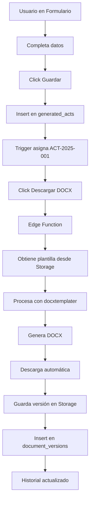

# 🎓 Tutorial Completo - Sistema de Generación DOCX

## 📚 Índice

1. [Introducción](#introducción)
2. [Arquitectura del Sistema](#arquitectura)
3. [Configuración Inicial](#configuración)
4. [Crear Primera Plantilla](#primera-plantilla)
5. [Generar Primer Documento](#primer-documento)
6. [Casos de Uso Avanzados](#casos-avanzados)
7. [Troubleshooting](#troubleshooting)

---

## 🌟 Introducción

### ¿Qué es el Sistema de Generación DOCX?

Un sistema automatizado que:
- ✅ Genera documentos legales profesionales en formato .docx
- ✅ Sustituye placeholders con datos reales
- ✅ Versionado automático de documentos
- ✅ Numeración secuencial
- ✅ Almacenamiento seguro
- ✅ Historial completo de versiones

### Beneficios

| Antes | Después |
|-------|---------|
| Manual en Word | **Automatizado** |
| Copiar/Pegar datos | **Hidratación automática** |
| Sin versionado | **Historial completo** |
| Archivos dispersos | **Almacenamiento centralizado** |
| Errores frecuentes | **Validaciones fail-fast** |

---

## 🏗️ Arquitectura



### Componentes Clave

#### Backend
- **Storage Buckets:**
  - `templates` - Plantillas .docx
  - `generated_documents` - Documentos generados
- **Tablas:**
  - `document_templates` - Catálogo de plantillas
  - `document_versions` - Versionado de documentos
  - `act_sequences` - Numeración automática
  - `generated_acts` - Actos generados
- **Edge Function:**
  - `generate-legal-doc` - Procesamiento DOCX

#### Frontend
- **Hooks:**
  - `useDocumentVersions` - Gestión de versiones
  - `useDocumentTemplates` - Catálogo de plantillas
- **Componentes:**
  - `UniversalIntakeForm` - Formulario principal
  - `DocumentVersionHistory` - Historial visual
  - `DocxPreview` - Vista previa
  - `TemplateSelector` - Selector de plantillas

---

## ⚙️ Configuración Inicial

### Paso 1: Verificar Estructura

```bash
# Backend debe tener:
✅ supabase/functions/generate-legal-doc/index.ts
✅ Buckets: templates, generated_documents
✅ Tablas: document_templates, document_versions, act_sequences

# Frontend debe tener:
✅ src/hooks/useDocumentVersions.tsx
✅ src/hooks/useDocumentTemplates.tsx
✅ src/components/legal-acts/UniversalIntakeForm.tsx
✅ src/components/legal-acts/DocumentVersionHistory.tsx
```

### Paso 2: Verificar Permisos

```sql
-- Verificar RLS en templates
SELECT * FROM storage.buckets WHERE id = 'templates';

-- Verificar RLS en generated_documents
SELECT * FROM storage.buckets WHERE id = 'generated_documents';

-- Verificar políticas
SELECT * FROM pg_policies WHERE tablename = 'document_versions';
```

### Paso 3: Datos de Prueba

```sql
-- Crear cliente de prueba
INSERT INTO clients (
  user_id, tenant_id, nombre_completo, 
  cedula_rnc_encrypted, nacionalidad, 
  estado_civil, profesion, direccion,
  provincia_id, municipio_id
) VALUES (
  auth.uid(), 
  (SELECT id FROM current_user_tenant LIMIT 1),
  'Juan Pérez García',
  encrypt_cedula('001-1234567-8'),
  'dominicana',
  'casado',
  'ingeniero',
  'Calle Principal #123',
  1, 1
);

-- Crear notario de prueba
INSERT INTO notarios (
  user_id, tenant_id, nombre,
  exequatur, oficina, jurisdiccion,
  telefono, email
) VALUES (
  auth.uid(),
  (SELECT id FROM current_user_tenant LIMIT 1),
  'Dr. Carlos Ventura',
  '2024-001',
  'Calle El Conde #45, Zona Colonial',
  'Santo Domingo',
  '809-555-1234',
  'carlos.ventura@example.com'
);
```

---

## 📝 Crear Primera Plantilla

### Paso 1: Diseñar en Word

#### Estructura Básica
```
REPÚBLICA DOMINICANA
CONTRATO DE ALQUILER

Número de Acto: {{NUMERO_ACTO}}

{{CIUDAD}}, {{FECHA_LARGA}}

ENTRE:

De una parte, {{P1_NOMBRE}}, de nacionalidad {{P1_NACIONALIDAD}}, 
mayor de edad, {{P1_ESTADO_CIVIL}}, {{P1_PROFESION}}, 
titular de la cédula No. {{P1_CEDULA_RNC}}, 
domiciliado(a) en {{P1_DOMICILIO}}, 
quien en lo adelante se denominará {{P1_ETIQUETA}}.

Y de la otra parte, {{P2_NOMBRE}}, de nacionalidad {{P2_NACIONALIDAD}},
mayor de edad, {{P2_ESTADO_CIVIL}}, {{P2_PROFESION}},
titular de la cédula No. {{P2_CEDULA_RNC}},
domiciliado(a) en {{P2_DOMICILIO}},
quien en lo adelante se denominará {{P2_ETIQUETA}}.

Han convenido celebrar el presente CONTRATO DE ALQUILER:

PRIMERO: OBJETO
{{P1_ETIQUETA}} da en alquiler a {{P2_ETIQUETA}} el inmueble:
{{INMUEBLE_DESCRIPCION}}, destinado a uso {{USO_INMUEBLE}}.

SEGUNDO: PRECIO
El canon mensual es de RD$ {{CANON_NUM}} ({{CANON_LETRAS}}), 
pagaderos por anticipado.

TERCERO: PLAZO
El contrato se celebra por {{PLAZO_MESES}} meses ({{PLAZO_LETRAS}}).

FE DE NOTARIO
Yo, {{NOTARIO_NOMBRE}}, Notario Público, Exequátur No. {{NOTARIO_EXEQUATUR}},
con oficina en {{NOTARIO_OFICINA}}, jurisdicción {{NOTARIO_JURISDICCION}},
CERTIFICO Y DOY FE...

_______________________          _______________________
{{P1_ETIQUETA}}                  {{P2_ETIQUETA}}
{{P1_NOMBRE}}                    {{P2_NOMBRE}}

_______________________
{{NOTARIO_NOMBRE}}
Notario Público
```

### Paso 2: Aplicar Formato

```
Título: Times New Roman, 16pt, Negrita, Centrado
Subtítulos: Times New Roman, 14pt, Negrita
Cuerpo: Times New Roman, 12pt, Justificado
Interlineado: 1.5
Márgenes: 3cm izq, 2cm der, 2.5cm arr/abajo
```

### Paso 3: Guardar

```
Nombre: contrato_alquiler.docx
Formato: .docx (NO .doc)
Sin contraseña
```

### Paso 4: Subir a Storage

```typescript
// 1. Ir al Backend (botón abajo derecha)
// 2. Storage → templates
// 3. Upload File → Seleccionar contrato_alquiler.docx
// 4. Verificar que aparece en la lista
```

### Paso 5: Registrar en BD

```sql
INSERT INTO document_templates (
  slug,
  nombre,
  descripcion,
  categoria,
  storage_path,
  version,
  activo,
  requiere_notario,
  requiere_contrato,
  roles_partes,
  campos_adicionales
) VALUES (
  'contrato-alquiler',
  'Contrato de Alquiler',
  'Contrato de arrendamiento de bienes inmuebles',
  'extrajudicial',
  'contrato_alquiler.docx',
  '1.0',
  true,
  true,
  true,
  '[
    {"role": "arrendador", "label": "Arrendador(es)", "min": 1, "max": 5},
    {"role": "arrendatario", "label": "Arrendatario(s)", "min": 1, "max": 5}
  ]'::jsonb,
  '[
    {"field": "inmueble_descripcion", "label": "Descripción del Inmueble", "type": "textarea", "required": true},
    {"field": "uso", "label": "Uso", "type": "select", "options": ["residencial", "comercial"], "required": true},
    {"field": "canon_monto", "label": "Canon (RD$)", "type": "number", "required": true},
    {"field": "plazo_meses", "label": "Plazo (meses)", "type": "number", "required": true}
  ]'::jsonb
);
```

---

## 🎯 Generar Primer Documento

### Paso 1: Navegar al Formulario

```
URL: /redaccion-ia-new?acto=contrato-alquiler&mode=intake
```

### Paso 2: Completar Datos

#### Información del Acto
```
Ciudad: Santo Domingo
Fecha: 2025-01-15
Número de Folios: 2
```

#### Primera Parte (Arrendador)
```
1. Click "+ Agregar"
2. Seleccionar cliente del dropdown
3. Verificar que se hidrataron:
   - Nombre completo ✅
   - Cédula ✅
   - Nacionalidad ✅
   - Estado civil ✅
   - Profesión ✅
4. Completar cascada geográfica:
   - Provincia: Distrito Nacional
   - Municipio: Santo Domingo Este
   - Sector: Los Jardines
```

#### Segunda Parte (Arrendatario)
```
(Repetir mismo proceso con otro cliente)
```

#### Notario
```
1. Seleccionar notario del dropdown
2. Verificar datos readonly:
   - Nombre completo ✅
   - Exequátur ✅
   - Oficina ✅
   - Jurisdicción ✅
```

#### Datos del Contrato
```
Descripción del Inmueble: "Casa de dos niveles ubicada en Calle Principal #123, Los Jardines, Santo Domingo Este"
Uso: Residencial
Canon Mensual: 15000
Plazo: 12
```

### Paso 3: Guardar

```
1. Click "Guardar y Asignar Número"
2. Ver toast: "Acto generado exitosamente: ACT-2025-001"
3. Campo "Número del Acto" se llena automáticamente
4. Botón "Descargar DOCX" se habilita
```

### Paso 4: Descargar DOCX

```
1. Click "Descargar DOCX"
2. Esperar 1-2 segundos
3. Archivo descarga automáticamente:
   Nombre: contrato_alquiler_ACT-2025-001.docx
4. Ver toast: "Documento DOCX generado y guardado exitosamente"
```

### Paso 5: Verificar Documento

```
1. Abrir archivo en Microsoft Word / LibreOffice
2. Verificar que NO hay:
   ❌ {{PLACEHOLDERS}}
   ❌ [CORCHETES]
   ❌ Campos vacíos
3. Verificar que SÍ hay:
   ✅ ACT-2025-001 en número de acto
   ✅ Nombres completos de las partes
   ✅ Cédulas correctas
   ✅ Domicilios con cascada geográfica
   ✅ Datos del notario
   ✅ "quince mil pesos" en canon
   ✅ "doce meses" en plazo
   ✅ Etiquetas correctas (EL ARRENDADOR, EL ARRENDATARIO)
```

### Paso 6: Ver Historial

```
1. Scroll down en la página del formulario
2. Ver sección "Historial de Documentos"
3. Verificar:
   ✅ Aparece versión 1
   ✅ Fecha "hace X minutos"
   ✅ Tamaño del archivo
   ✅ Badge "Última"
   ✅ Botón "Descargar"
   ✅ Botón eliminar
```

---

## 🚀 Casos de Uso Avanzados

### Caso 1: Generar 5 Versiones del Mismo Acto

```typescript
// 1. Generar documento inicial
// 2. Modificar un dato (ej: canon)
// 3. Click "Descargar DOCX" nuevamente
// 4. Repetir 5 veces
// 5. Ver historial:
//    - Versión 5 (Última)
//    - Versión 4
//    - Versión 3
//    - Versión 2
//    - Versión 1
// 6. Descargar cualquier versión anterior
```

### Caso 2: Persona Jurídica como Parte

```typescript
// Cliente con:
tipo_persona: "juridica"
razon_social: "INMOBILIARIA XYZ, SRL"
cedula_rnc: "1-31-12345-6" // RNC

// En documento final aparece:
"INMOBILIARIA XYZ, SRL"
"RNC 1-31-12345-6"
"EL ARRENDADOR" (sin género)
```

### Caso 3: Múltiples Arrendadores

```typescript
// En DynamicPartiesManager:
// Click "+ Agregar" 3 veces
// Agregar 3 clientes diferentes

// Modificar edge function para loop:
{{#ARRENDADORES}}
- {{NOMBRE}}
{{/ARRENDADORES}}
```

### Caso 4: Cambiar de Plantilla

```typescript
// Agregar selector en formulario:
<TemplateSelector 
  categoria="extrajudicial"
  value={selectedTemplate}
  onChange={setSelectedTemplate}
/>

// En handleGenerateDocx:
const payload = {
  ...formData,
  template_slug: selectedTemplate
};
```

---

## 🐛 Troubleshooting

### Problema 1: Template not found

**Síntoma:**
```
Error: Template not found: contrato_alquiler.docx
```

**Solución:**
```bash
# 1. Verificar que existe en Storage
# Backend → Storage → templates → Ver lista

# 2. Verificar nombre exacto (sensible a mayúsculas)
# Debe ser EXACTAMENTE: contrato_alquiler.docx

# 3. Re-subir si es necesario
```

### Problema 2: Variables sin sustituir

**Síntoma:**
```
Documento final contiene: {{P1_NOMBRE}}
```

**Solución:**
```typescript
// 1. Verificar que la variable existe en el edge function
// supabase/functions/generate-legal-doc/index.ts
// Buscar: P1_NOMBRE

// 2. Verificar mayúsculas en plantilla
// Debe ser {{P1_NOMBRE}}, no {{p1_nombre}}

// 3. Verificar que el campo está lleno
console.log(payload.primera_parte.nombre_completo);

// 4. Ver logs del edge function
// Backend → Edge Functions → generate-legal-doc → Logs
```

### Problema 3: Falta dato requerido

**Síntoma:**
```
Error: Falta dato requerido: contrato.canon_monto
```

**Solución:**
```typescript
// 1. Verificar que todos los campos obligatorios están llenos
// En el formulario, buscar el campo:
<Input {...register('contrato.canon_monto')} />

// 2. Ver valores del formulario
console.log(form.getValues());

// 3. Agregar valor por defecto si aplica
defaultValues: {
  contrato: {
    canon_monto: 0 // Cambiar a valor apropiado
  }
}
```

### Problema 4: Descarga HTML en vez de DOCX

**Síntoma:**
```
Archivo descarga como .html o texto plano
```

**Solución:**
```typescript
// Verificar que edge function retorna arraybuffer
return new Response(generatedBuffer, {
  headers: {
    "Content-Type": "application/vnd.openxmlformats-officedocument.wordprocessingml.document",
    "Content-Disposition": `attachment; filename="${filename}"`
  }
});

// Verificar en frontend:
const blob = new Blob([response.data], {
  type: 'application/vnd.openxmlformats-officedocument.wordprocessingml.document'
});
```

### Problema 5: Versión no se guarda

**Síntoma:**
```
Historial siempre vacío
```

**Solución:**
```typescript
// 1. Verificar que el acto tiene ID
console.log(form.getValues('id'));

// 2. Verificar que se llama a supabase.rpc
const { data: nextVersion } = await supabase.rpc('get_next_document_version', {
  p_act_id: data.id
});

// 3. Ver logs de storage
// Backend → Storage → generated_documents → Ver uploads recientes

// 4. Verificar RLS
// Usuario debe tener permiso de INSERT en document_versions
```

---

## 📚 Recursos Adicionales

### Documentación
- [SISTEMA_GENERACION_DOCX.md](./SISTEMA_GENERACION_DOCX.md) - Guía completa
- [CHECKLIST_PRUEBAS_DOCX.md](./CHECKLIST_PRUEBAS_DOCX.md) - Testing
- [GUIA_CREACION_PLANTILLAS.md](./GUIA_CREACION_PLANTILLAS.md) - Crear plantillas
- [CATALOGO_PLANTILLAS.md](./CATALOGO_PLANTILLAS.md) - Plantillas disponibles

### Herramientas
- Microsoft Word 2016+
- LibreOffice Writer
- [Docxtemplater Playground](https://docxtemplater.com/demo/)

### Soporte
- Discord: [Lovable Community](https://discord.gg/lovable)
- Docs: [Lovable Documentation](https://docs.lovable.dev)

---

**Versión:** 1.0  
**Fecha:** 2025-01-15  
**Autor:** Sistema PraxisLex  
**Estado:** ✅ Tutorial Completo
