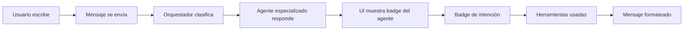

# FASE 3 - UI Mejorada y Experiencia de Chat ✅

## Resumen

Mejoramos significativamente la interfaz del chat AI-OS para hacerla más informativa, intuitiva y visualmente atractiva.

---

## 🎨 Mejoras Implementadas

### 1. **Visualización de Agentes Activos**

Ahora cada respuesta del asistente muestra claramente:
- **Badge del agente** que está respondiendo (con icono y color específico)
- **Intención detectada** en badge secundario
- **Herramientas utilizadas** al final del mensaje

```tsx
// Ejemplo de cómo se ve:
[📄 Casos] [buscar_caso]
"Encontré 3 casos relacionados con tu búsqueda..."
🧠 Herramientas: buscar_casos
```

### 2. **Código de Colores por Agente**

Cada agente tiene su identidad visual:

| Agente | Color | Icono |
|--------|-------|-------|
| AgenteCasos | 🔵 Azul | FileText |
| AgenteDocumentos | 🟣 Púrpura | FileText |
| AgenteClientes | 🟢 Verde | Users |
| AgenteCalendario | 🟠 Naranja | Calendar |
| AgenteContabilidad | 🟡 Amarillo | DollarSign |
| AgenteJurisprudencia | 🟣 Índigo | Scale |
| AgenteGeneral | ⚪ Gris | Bot |

### 3. **Pantalla de Bienvenida Interactiva**

Cuando no hay mensajes, el usuario ve:
- **Mensaje de bienvenida** explicando las capacidades
- **4 acciones rápidas** para comenzar:
  - Ver mis casos
  - Próximas audiencias
  - Ver plantillas
  - Calcular plazo

### 4. **Header Informativo**

El header del chat muestra:
- **Badge "AI-OS"** indicando el sistema multi-agente
- **Descripción** clara: "Asistente inteligente con agentes especializados"
- **Icono Sparkles** para representar capacidades de IA

### 5. **Indicadores de Estado**

- **Loading spinner** mientras el agente procesa
- **Avatar del bot** en mensajes del asistente
- **Avatar del usuario** en mensajes del usuario
- **Scroll automático** a nuevos mensajes

---

## 🔧 Componentes Actualizados

### `ChatGlobalPraxisLex.tsx`

**Nuevas características**:
- Iconos por agente (`AGENT_ICONS`)
- Colores por agente (`AGENT_COLORS`)
- Función `renderAgentBadge()` para mostrar información del agente
- Pantalla de bienvenida con sugerencias
- Badges visuales para metadata

### `useChatAIOS.tsx`

**Mejoras**:
- Metadata estructurada en cada mensaje
- Extracción de `agente`, `intencion` y `tools_used` desde la respuesta
- Mejor manejo de errores y rollback de mensajes fallidos

---

## 📊 Flujo de Interacción Mejorado



---

## 💡 Próximos Pasos Sugeridos

### FASE 4 - Memoria Contextual Avanzada
- Implementar `agent_patterns` para aprendizaje
- Sugerencias basadas en uso frecuente
- Auto-completado inteligente

### FASE 5 - Más Herramientas
- Crear caso desde chat
- Generar documento desde chat
- Programar audiencia desde chat
- Búsqueda de jurisprudencia RAG

### FASE 6 - Analytics de Agentes
- Dashboard de uso de agentes
- Métricas de intenciones más comunes
- Eficiencia de herramientas

---

## ✅ Estado Actual

| Componente | Estado |
|------------|--------|
| Memoria conversacional | ✅ Implementado |
| 7 Agentes especializados | ✅ Implementado |
| Clasificador de intenciones | ✅ Implementado |
| 6 Herramientas funcionales | ✅ Implementado |
| UI mejorada con badges | ✅ Implementado |
| Pantalla de bienvenida | ✅ Implementado |
| Código de colores | ✅ Implementado |
| Metadata visible | ✅ Implementado |

---

## 🎯 Objetivos Logrados

1. ✅ Usuario puede ver claramente qué agente está respondiendo
2. ✅ Usuario entiende qué intención se detectó
3. ✅ Usuario ve qué herramientas se usaron
4. ✅ Interface es más profesional y educativa
5. ✅ Acciones rápidas facilitan el onboarding

---

## 📝 Notas de Implementación

- Todos los estilos usan tokens del design system (no colores hardcoded)
- Componente es completamente responsive
- Manejo de errores robusto con rollback
- Auto-scroll a nuevos mensajes
- Loading states claros

**FASE 3 COMPLETADA** 🎉
